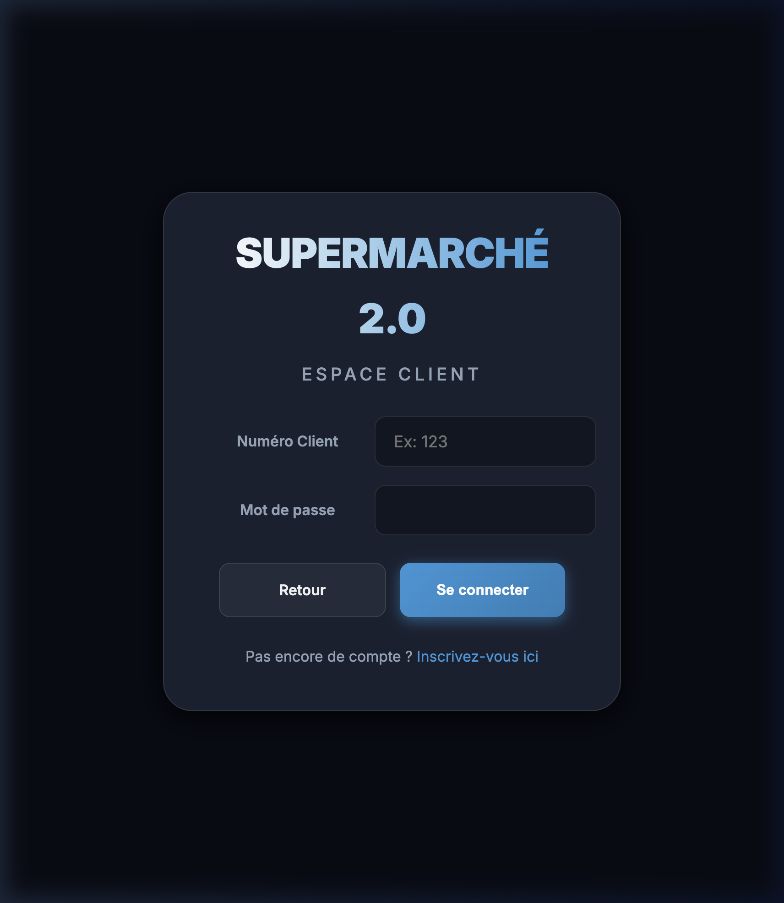
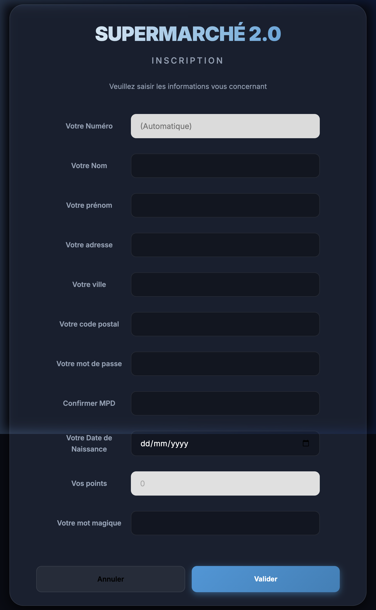
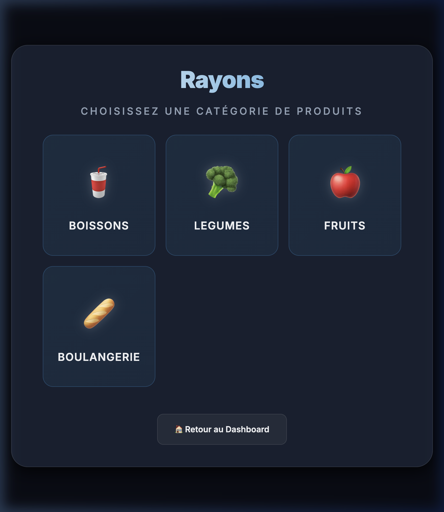
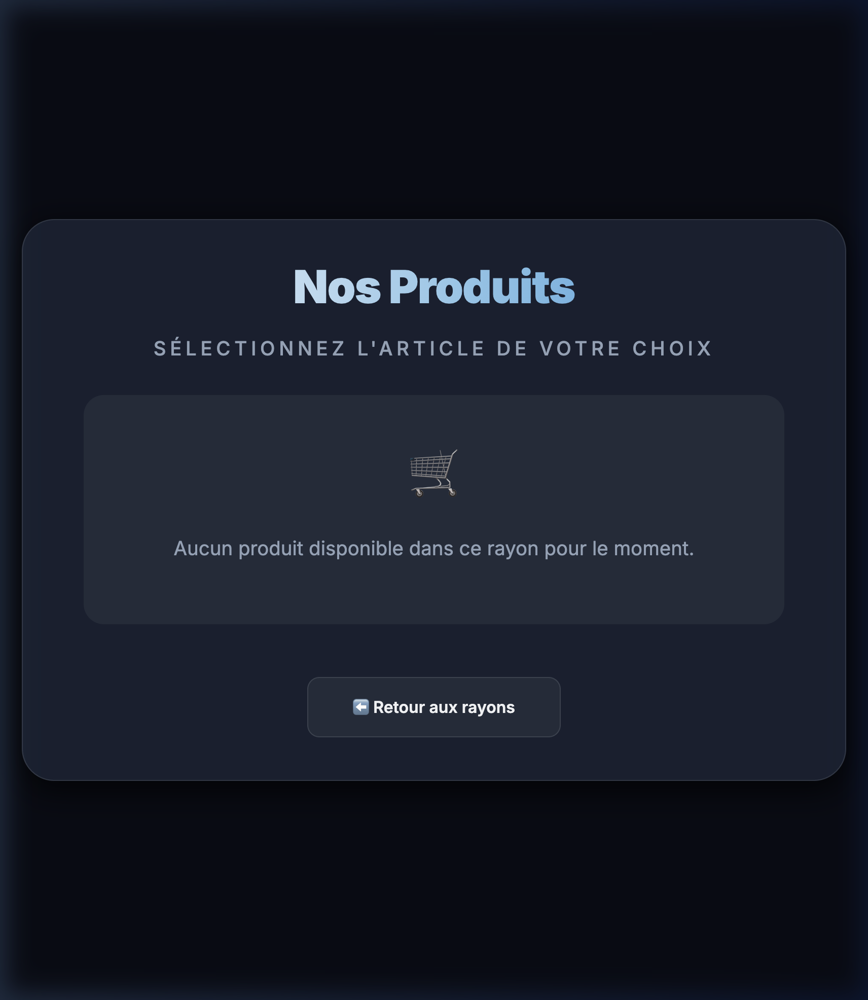
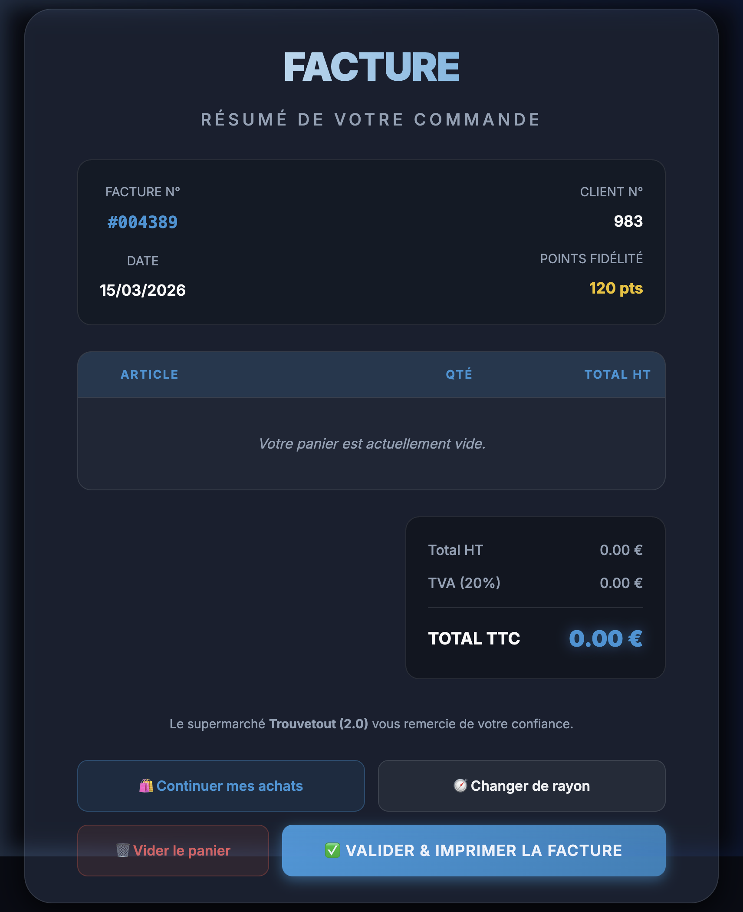

# 🛒 Supermarché 2.0

> Application web de gestion d'un supermarché développée en **PHP / MySQL**, avec authentification, gestion d'un panier, génération de factures et un panneau d'administration complet.

---

## 📸 Aperçu

### 🏠 Tableau de bord


### 🔐 Connexion


### 🆔 Inscription / Carte Fidélité


### 🚀 Passer une commande (Rayons)


### 🛍️ Catalogue Produits


### 🧾 Facture


---

## ✨ Fonctionnalités

| Fonctionnalité | Description |
|---|---|
| 🏠 **Tableau de bord** | Page d'accueil avec animation de lancement (splash screen) et navigation principale |
| 🔐 **Authentification** | Connexion par ID client + mot de passe, gestion de session PHP |
| 🆔 **Inscription** | Création d'un compte adhérent avec carte de fidélité et mot magique |
| 🛒 **Panier** | Sélection de produits par rayon, choix des quantités |
| 🧾 **Facture** | Génération automatique de facture récapitulative avec détail des produits |
| ⚙️ **Admin – Clients** | CRUD complet sur les adhérents (ajouter, modifier, supprimer) |
| ⚙️ **Admin – Produits** | CRUD complet sur le catalogue produits avec upload d'image |
| 🏷️ **Points fidélité** | Système de points attribués aux adhérents |

---

## 🗂️ Structure du projet

```
Supermarche/
├── index.php               # Contrôleur Frontal (Routeur)
├── models/
│   └── Modele.php          # Couche d'accès aux données (PDO)
├── controllers/
│   ├── ControllerAuth.php  # Authentification & Inscription
│   ├── ControllerCatalog.php # Navigation & Commande
│   └── ControllerAdmin.php # Administration & Sécurité RBAC
├── views/
│   ├── layout.php          # Gabarit global (Design System)
│   └── pages/              # Contenus HTML spécifiques
├── css/
│   └── style.css           # Styles globaux (thème sombre)
├── img/                    # Images des produits
├── sql/
│   └── supermarche.sql     # Dump complet de la base de données
└── old_files_backup/       # Archives des anciens fichiers racines
```

---

## 🗄️ Base de données

### Schéma relationnel

```
adherent         famille
─────────        ────────
IdClient (PK)    IdFamille (PK)
Nom              NomFamille
Prenom
Adresse          produit
Ville            ────────
CodePostal       IdProduit (PK)
MotDePasse       NomProd
Date_naissance   Prix
point            IdFamille (FK → famille)
MotMagique       Image
role (client, admin_produits, admin_prix, admin_comptes, super_admin)
                 facture           contenir
                 ────────          ────────
                 NumFacture (PK)   NumFacture (FK)
                 DateFacture       IdProduit  (FK)
                 IdClient (FK)     Quantite
```

### Tables

| Table | Description | Nb enregistrements |
|---|---|---|
| `adherent` | Clients / adhérents | 5 (exemples) |
| `famille` | Rayons (boissons, légumes, fruits, boulangerie) | 4 |
| `produit` | Catalogue complet | **129 produits** |
| `facture` | Commandes passées | 4 (exemples) |
| `contenir` | Lignes de facture (produit + quantité) | 4 (exemples) |

### Familles de produits

| ID | Rayon | Exemples |
|---|---|---|
| 1 | 🥤 Boissons | Pepsi, Coca-Cola Zéro, Red Bull, Champagne… |
| 2 | 🥕 Légumes | Carottes, Courgettes, Poivrons, Champignons… |
| 3 | 🍓 Fruits | Fraises, Mangue, Ananas, Cerises… |
| 4 | 🥖 Boulangerie | Pain, Croissants, Éclairs, Sandwichs… |

---

## ⚙️ Installation

### Prérequis

- [XAMPP](https://www.apachefriends.org/) (ou tout serveur Apache + PHP + MySQL)
- PHP **8.0+**
- MariaDB / MySQL **10.4+**

### Étapes

1. **Cloner / copier le projet** dans le dossier `htdocs` de XAMPP :
   ```bash
   git clone <url-du-repo> /Applications/XAMPP/xamppfiles/htdocs/Supermarche
   ```

2. **Démarrer XAMPP** : lancer Apache et MySQL depuis le panneau de contrôle.

3. **Importer la base de données** :
   - Ouvrir [phpMyAdmin](http://localhost/phpmyadmin)
   - Créer une base de données nommée **`supermarche`**
   - Importer le fichier `sql/supermarche.sql`

4. **Accéder à l'application** :
   ```
   http://localhost/Supermarche/
   ```

---

## 🔑 Comptes de test

| ID Client | Nom | Prénom | Mot de passe | Rôle |
|:---:|---|---|---|---|
| `1` | toto | tata | `azerty1` | `client` |
| `2` | lola | marko | `azerty2` | `admin_produits` |
| `3` | lola | marko | `azerty2` | `admin_prix` |
| `4` | bombe | yanis | `azerty3` | `admin_comptes` |
| `5` | ONEPIECE | Tina | `1234AZER` | `super_admin` |
| `6` | cleaner | jean | `cleanit` | `admin_suppression` |

> [!NOTE]
> Le niveau d'accès est désormais géré par le champ `role`. Chaque administrateur a des droits restreints selon sa fonction.

---

## 🧪 Guide de Test des Rôles

Pour vérifier le bon fonctionnement des permissions, suivez ces étapes :

### 1. Préparation
- Importez le fichier `SQL/supermarche.sql` dans votre base de données `supermarche` via phpMyAdmin (cela mettra à jour les rôles des comptes de test).

### 2. Test Admin Produits (Gestion des Articles)
- Connectez-vous avec l'ID `2` (Mot de passe: `azerty2`).
- Cliquez sur **📦 Gestion Produits**.
- Vérifiez que vous pouvez **ajouter** un produit et le **supprimer**.
- En modifiant un produit, vérifiez que le champ **Prix** est verrouillé (gris).

### 3. Test Admin Prix (Modification Tarifaire)
- Connectez-vous avec l'ID `3` (Mot de passe: `azerty2`).
- Cliquez sur **📦 Gestion Produits**.
- Vérifiez que les boutons "Nouveau Produit" et "Supprimer" sont **masqués**.
- En modifiant un produit, vérifiez que **seul le champ Prix** est modifiable. Tous les autres champs doivent être verrouillés.

### 4. Test Admin Suppression (Nouveau rôle)
- Connectez-vous avec l'ID `6` (Mot de passe: `cleanit`).
- Cliquez sur **📦 Gestion Produits**.
- Vérifiez que vous voyez l'icône de suppression (🗑️) mais **pas** le bouton "Nouveau Produit".
- Tentez de modifier un produit : vous ne devriez pouvoir rien changer (car vous n'êtes pas admin_produits ni admin_prix).

### 5. Test Admin Comptes (Gestion Adhérents)
- Connectez-vous avec l'ID `4` (Mot de passe: `azerty3`).
- Vérifiez que vous avez accès au bouton **👥 Gestion Comptes**.
- Vérifiez que vous pouvez changer le rôle d'un utilisateur ou le supprimer.
- Tentez d'accéder manuellement à `admin_produits.php` : vous devez être redirigé vers l'accueil.

### 5. Test Super Admin
- Connectez-vous avec l'ID `5` (Mot de passe: `1234AZER`).
- Vérifiez que vous avez accès à **tout** (Comptes + Produits) et que tous les champs sont éditables.


---

## 🛠️ Technologies utilisées

| Technologie | Usage |
|---|---|
| **PHP 8** | Backend, sessions, logique métier |
| **PDO (MySQL)** | Accès sécurisé à la base de données |
| **MariaDB / MySQL** | Stockage des données |
| **HTML5 / CSS3** | Interface utilisateur |
| **Vanilla JS** | Animation splash screen |
| **XAMPP** | Stack de développement local |

---

## 🏗️ Architecture MVC

L'application suit désormais une architecture **MVC (Modèle-Vue-Contrôleur)** propre :

- **Modèle** (`models/Modele.php`) : Centralise toutes les requêtes SQL via PDO.
- **Vues** (`views/`) : Séparation du design (`layout.php`) et du contenu (`pages/`).
- **Contrôleurs** (`controllers/`) : Gèrent la logique métier, les calculs et la sécurité.
- **Routeur** (`index.php`) : Analyse l'action demandée et délègue au bon contrôleur.

### Sécurités mises en place

- ✅ Requêtes préparées PDO (protection contre les injections SQL)
- ✅ `htmlspecialchars()` sur les affichages utilisateur
- ✅ Sessions PHP pour l'authentification
- ✅ Transactions SQL pour les suppressions en cascade

---

## 📁 Données de configuration

Le fichier de connexion se trouve dans `php/Modele.php` :

```php
$this->bdd = new PDO('mysql:host=localhost;dbname=supermarche;charset=utf8', 'root', '');
```

> Modifier `host`, `dbname`, l'utilisateur et le mot de passe selon votre configuration.

---

## 📄 Licence

Projet scolaire — usage libre à des fins pédagogiques.
